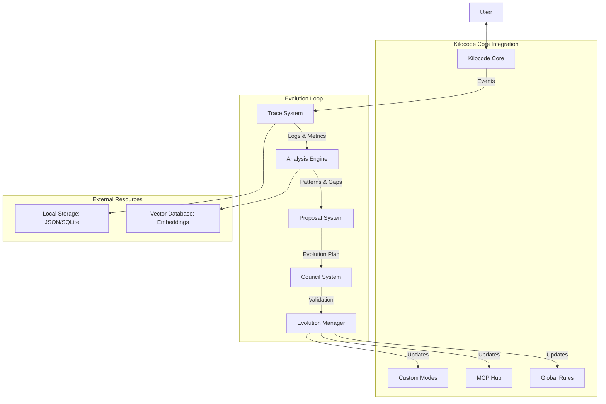
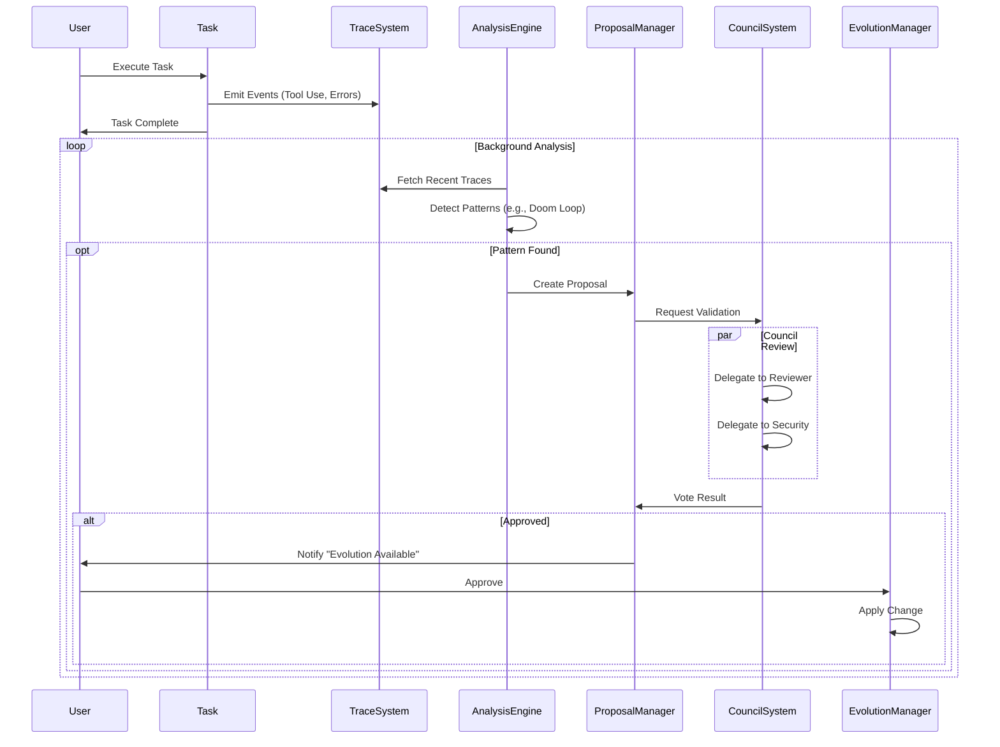
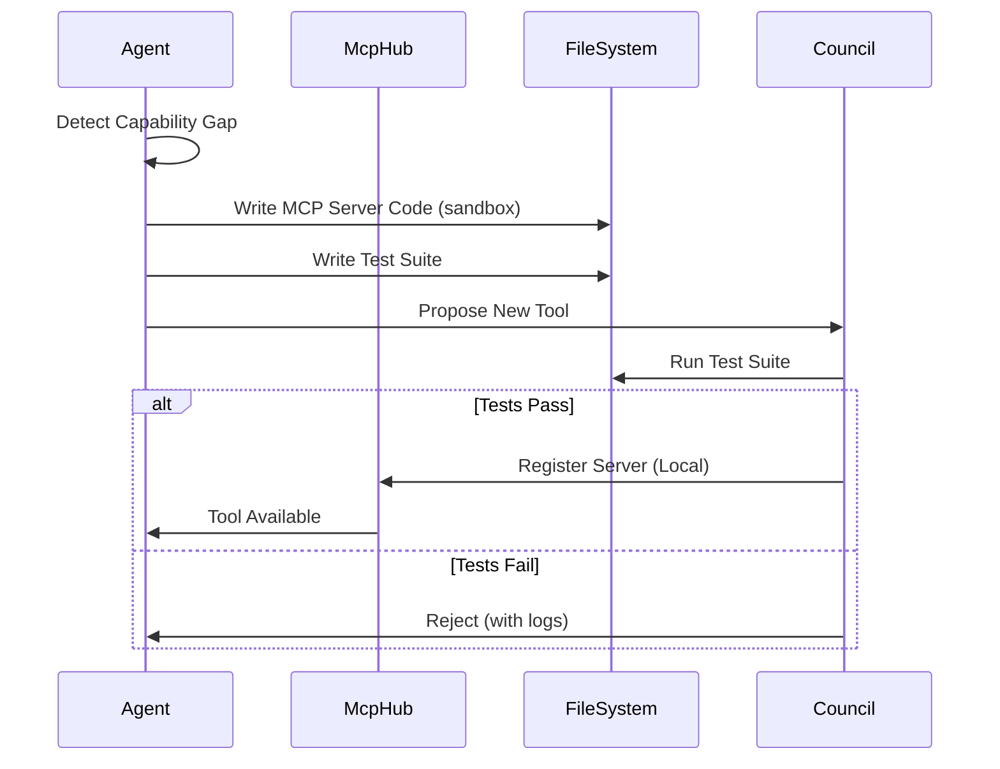

# Kilocode Evolution System: Architectural Design

## 1. Executive Summary

The Kilocode Evolution System is a self-healing, self-improving architecture inspired by Darwin but natively integrated into Kilocode's VS Code extension environment. It transforms Kilocode from a static tool into a dynamic agent that learns from user interactions, optimizes its own workflows, and extends its capabilities through Model Context Protocol (MCP).

**Core Philosophy:**

- **Modes are Agents:** We leverage Kilocode's Custom Modes as specialized agents.
- **Delegation is Collaboration:** We use `delegateParentAndOpenChild` for multi-agent coordination (The Council).
- **MCP is Capability:** We evolve by synthesizing and registering new MCP servers.
- **Telemetry is Memory:** We use enhanced telemetry as the "Trace" for analysis.

## 2. System Architecture

### High-Level Components



### Component Responsibilities

1.  **Trace System**: Captures high-fidelity execution data (tool use, errors, user feedback) without compromising privacy. Extends existing `TelemetryService`.
2.  **Analysis Engine**: A background process (or specialized "Analyst Mode") that scans traces for patterns, inefficiencies, and "doom loops".
3.  **Proposal System**: Generates structured `EvolutionProposal` objects (e.g., "Create new MCP tool", "Refine System Prompt").
4.  **Council System**: A multi-agent review board (Orchestrator, Reviewer, Security) that validates proposals using `delegateParentAndOpenChild`.
5.  **Evolution Manager**: The executor that applies approved changes to `CustomModesManager`, `McpHub`, or configuration files.

## 3. Trace System Design

The Trace System builds upon Kilocode's existing `TelemetryService` and `TaskHistory` to provide the raw data for evolution.

### 3.1 Events to Capture

In addition to standard telemetry, we capture "Evolution Events":

- **`ToolErrorPattern`**: Repeated failures of a specific tool with similar error messages.
- **`UserCorrection`**: Instances where the user explicitly corrects the agent (e.g., "No, use `fs.promises` instead").
- **`ContextOverflow`**: Frequency of context window exhaustion.
- **`DoomLoop`**: Detection of repetitive, non-productive tool sequences.

### 3.2 Data Schema

Traces are stored locally to respect privacy, with only anonymized metrics sent to the cloud.

```typescript
interface TraceEvent {
	id: string
	taskId: string
	timestamp: number
	type: "tool_error" | "user_correction" | "doom_loop" | "success_pattern"
	severity: "low" | "medium" | "high" | "critical"
	context: {
		toolName?: string
		errorMessage?: string
		userMessage?: string
		fileExtension?: string
		mode: string
	}
	// Redacted content for privacy
	snippet?: string
}

interface TraceSession {
	taskId: string
	mode: string
	duration: number
	outcome: "success" | "failure" | "aborted"
	events: TraceEvent[]
}
```

### 3.3 Storage Strategy

- **Hot Storage**: In-memory buffer for active tasks (part of `Task` instance).
- **Cold Storage**: JSON-based log files in `globalStorage/traces/`.
- **Retention**: Rolling window (e.g., 30 days) to manage disk space.

### 3.4 Integration

- Hook into `ClineProvider.ts` event listeners (`onTaskCompleted`, `onTaskAborted`).
- Extend `TelemetryService` to emit local trace events.

## 4. Analysis Engine Design

The Analysis Engine is the "Brain" of the evolution system. It runs periodically or on-demand to identify opportunities for improvement.

### 4.1 Pattern Detection

- **Doom Loop Detector**: Identifies sequences like `Edit -> Error -> Edit -> Error` (same error).
- **Gap Analysis**: Identifies requests where the agent says "I cannot do that" or "I don't have a tool for that".
- **Instruction Drift**: Identifies when the agent consistently ignores a custom instruction.

### 4.2 Trigger Conditions

- **Post-Task**: After a task completes (especially if failed).
- **Periodic**: Nightly scan of the last 24h of traces.
- **Manual**: User invokes "Analyze My Workflow".

### 4.3 Output

Produces an `AnalysisReport` containing:

- Identified patterns.
- Confidence score.
- Recommended action type (Rule Update, New Tool, Mode Tweak).

## 5. Council System Design

The Council is the "Conscience" of the system, ensuring changes are safe and beneficial. It leverages Kilocode's `delegateParentAndOpenChild` to spawn specialized subtasks.

### 5.1 Council Composition

The Council is dynamic but typically includes:

1.  **Orchestrator (Chair)**: The parent task managing the review.
2.  **Reviewer (Member)**: A `code-reviewer` mode instance that checks for logic and quality.
3.  **Security (Member)**: A `security` mode instance that checks for permissions and safety.

### 5.2 Voting Mechanism

- The Chair delegates a validation task to each Member.
- The Member performs the check and returns a `completionResultSummary`.
- The Chair parses the summary as a Vote (Approve/Reject/Request Changes).
- **Consensus**: Unanimous approval required for high-risk changes (e.g., new MCP tools). Majority for low-risk (e.g., prompt tweaking).

### 5.3 Implementation

```typescript
// Pseudo-code for Council Logic
async function conveneCouncil(proposal: EvolutionProposal) {
	const chair = this.getCurrentTask()

	// Delegate to Reviewer
	const reviewerTask = await provider.delegateParentAndOpenChild({
		parentTaskId: chair.taskId,
		mode: "code-reviewer",
		message: `Review this proposal: ${JSON.stringify(proposal)}`,
	})

	// ... wait for completion ...

	// Delegate to Security
	const securityTask = await provider.delegateParentAndOpenChild({
		parentTaskId: chair.taskId,
		mode: "security",
		message: `Security audit for: ${JSON.stringify(proposal)}`,
	})

	// ... aggregate results ...
}
```

## 6. Mode Evolution Design

Modes evolve by refining their prompts and toolsets.

### 6.1 Evolution Strategies

1.  **Instruction Refinement**: Appending clarifications to `customInstructions` based on `UserCorrection` traces.
2.  **Tool Group Adjustment**: Adding/removing tool groups from a mode definition.
3.  **Temperature Tuning**: Adjusting model temperature based on task success rates.

### 6.2 Validation

- **Dry Run**: Create a temporary task with the new configuration and run a standard test prompt.
- **A/B Testing (Future)**: Randomly assign the new configuration to 10% of tasks (Phase 3).

### 6.3 Rollback

- Store previous mode configurations in `globalStorage/modes_backup/`.
- Provide a "Revert Mode" command.

## 7. Tool Evolution Design (MCP Focus)

Tools evolve by creating and registering new MCP servers.

### 7.1 Gap Detection

- Triggered when the agent explicitly states it lacks a capability.
- Triggered by repetitive manual execution of shell commands (e.g., "run this curl command 50 times").

### 7.2 MCP Server Synthesis

- The agent writes a simple MCP server (Python or Node.js).
- It uses the `write_to_file` tool to save it to `globalStorage/mcp/custom/`.

### 7.3 Registration

- The agent uses `McpHub` to register the new server in `kilocode_config.json`.
- **Constraint**: Custom MCP servers are sandboxed (cannot access outside their directory unless explicitly granted).

### 7.4 Validation

- The agent must generate a test suite for the new MCP tool.
- The Council runs the test suite in a subtask.
- Only if tests pass is the tool registered globally.

## 8. Proposal System Design

Standardizes how changes are suggested and applied.

### 8.1 Proposal Schema

```typescript
interface EvolutionProposal {
	id: string
	type: "new_tool" | "update_rule" | "modify_mode"
	target: string // e.g., "architect-mode" or "global-rules"
	content: any // The actual change (code, text, config)
	reasoning: string
	riskLevel: "low" | "medium" | "high"
	status: "pending" | "reviewing" | "approved" | "rejected" | "applied"
}
```

### 8.2 Review Process

1.  **Generation**: Analysis Engine creates `EvolutionProposal`.
2.  **Council Review**: Council validates and votes.
3.  **User Approval**: (Optional but recommended for MVP) User sees a notification "Kilocode wants to improve X. Review?".
4.  **Application**: Evolution Manager applies the change.

## 9. Safety & Validation Design

### 9.1 Write Boundaries

- Evolution agents can ONLY write to:
    - `globalStorage/mcp/custom/`
    - `globalStorage/traces/`
    - `.kilocoderules` (workspace specific)
    - `kilocode_config.json` (via API, not direct file edit)

### 9.2 Validation Stages

1.  **Syntax Check**: Code must parse.
2.  **Static Analysis**: Linter checks.
3.  **Sandbox Test**: Execution in isolated environment.
4.  **Council Review**: Semantic check.
5.  **User Gate**: Final human approval.

### 9.3 Backup & Rollback

- **Configuration Snapshots**: Before any config change, save a copy.
- **Git Checkpoints**: Use `ShadowCheckpointService` to snapshot the workspace before applying code changes.

## 10. State Management Design

### 10.1 State Schema

```typescript
interface EvolutionState {
	lastAnalysisTimestamp: number
	activeProposals: EvolutionProposal[]
	evolutionHistory: {
		timestamp: number
		proposalId: string
		outcome: string
	}[]
	metrics: {
		doomLoopsAvoided: number
		toolsCreated: number
		rulesRefined: number
	}
}
```

### 10.2 Storage

- Persisted in `globalState` (VS Code Memento) or a dedicated JSON file in `globalStorage`.

## 11. Integration Architecture

### 11.1 Extension Integration

- **`EvolutionService`**: A new singleton service initialized in `activate()`.
- **`ClineProvider`**: Emits events to `EvolutionService`.
- **`McpHub`**: Exposes methods for `EvolutionService` to register tools.

### 11.2 File Structure

```
src/
  services/
    evolution/
      EvolutionService.ts
      AnalysisEngine.ts
      CouncilManager.ts
      ProposalManager.ts
      TraceSystem.ts
      interfaces.ts
```

## 12. Sequence Diagrams

### 12.1 Evolution Loop Workflow



### 12.2 MCP Tool Synthesis Workflow



## 13. Appendix: Data Schemas

```typescript
/**
 * Represents a single event in the evolutionary trace.
 */
export interface TraceEvent {
	id: string
	taskId: string
	timestamp: number
	type: TraceEventType
	severity: "info" | "low" | "medium" | "high" | "critical"
	source: "tool" | "system" | "user"
	content: {
		toolName?: string
		error?: string
		userFeedback?: string
		contextSummary?: string
	}
	metadata?: Record<string, any>
}

export type TraceEventType =
	| "tool_execution"
	| "tool_error"
	| "user_correction"
	| "doom_loop_detected"
	| "capability_gap"
	| "success_pattern"

/**
 * Represents a proposed change to the system.
 */
export interface EvolutionProposal {
	id: string
	createdAt: number
	source: "analysis_engine" | "user_request" | "manual"
	type: "new_tool" | "update_rule" | "modify_mode" | "config_change"
	target: string // Identifier of the target (e.g., mode slug, rule file)

	// The actual change payload
	payload: {
		action: "create" | "update" | "delete"
		path?: string // For file-based changes
		content?: any // The new content/config
		diff?: string // For text/code changes
	}

	reasoning: {
		trigger: string // What triggered this (e.g., "Error pattern X detected")
		benefit: string // Expected improvement
		riskAnalysis: string
	}

	status: ProposalStatus
	votes: CouncilVote[]
}

export type ProposalStatus = "pending" | "reviewing" | "approved" | "rejected" | "applied" | "failed"

/**
 * Represents a vote from a Council member.
 */
export interface CouncilVote {
	memberId: string // e.g., "reviewer-mode", "security-mode"
	vote: "approve" | "reject" | "request_changes"
	feedback: string
	timestamp: number
}

/**
 * Represents the output of the Analysis Engine.
 */
export interface AnalysisReport {
	id: string
	timestamp: number
	periodStart: number
	periodEnd: number
	analyzedTraceCount: number
	findings: {
		patternId: string
		confidence: number
		description: string
		affectedModes: string[]
		suggestedProposal?: EvolutionProposal
	}[]
}

/**
 * Persisted state of the Evolution System.
 */
export interface EvolutionState {
	version: number
	lastAnalysisRun: number
	activeProposals: string[] // IDs
	appliedProposals: string[] // IDs (history)
	metrics: {
		totalEvolutions: number
		successRate: number
		uptime: number
	}
}
```

## 14. MVP Scope (Phase 1)

For the initial release, we focus on the "Trace -> Analyze -> Propose" loop with manual user approval.

**Included:**

- [ ] **Trace System**: Capture `ToolError` and `UserCorrection`.
- [ ] **Analysis Engine**: Simple regex-based pattern matching for "Doom Loops".
- [ ] **Proposal System**: Generate simple "Update Rule" proposals.
- [ ] **User Interface**: A "Review Proposals" notification/command.
- [ ] **Application**: Ability to append to `.kilocoderules`.

**Excluded (Future):**

- Automatic MCP synthesis (Phase 2).
- Full Council delegation (Phase 2).
- Autonomous application without user approval (Phase 3).

## 15. Open Questions

1.  **Storage Limits**: How much trace data can we store locally (JSON/SQLite) before performance degrades? We need a robust pruning strategy.
2.  **Council Latency**: Will spinning up multiple subtasks for the Council be too slow for the user? We might need a "Fast Track" for simple changes.
3.  **MCP Sandbox**: How do we securely sandbox custom MCP servers on the user's machine without requiring Docker? We may need to rely on process isolation and strict permission scopes.
4.  **Model Costs**: The Analysis Engine and Council will consume tokens. How do we make this transparent to the user? We should add an "Evolution Budget" setting.
5.  **Conflict Resolution**: What happens if two modes propose conflicting rules? The Orchestrator needs a conflict resolution strategy.
