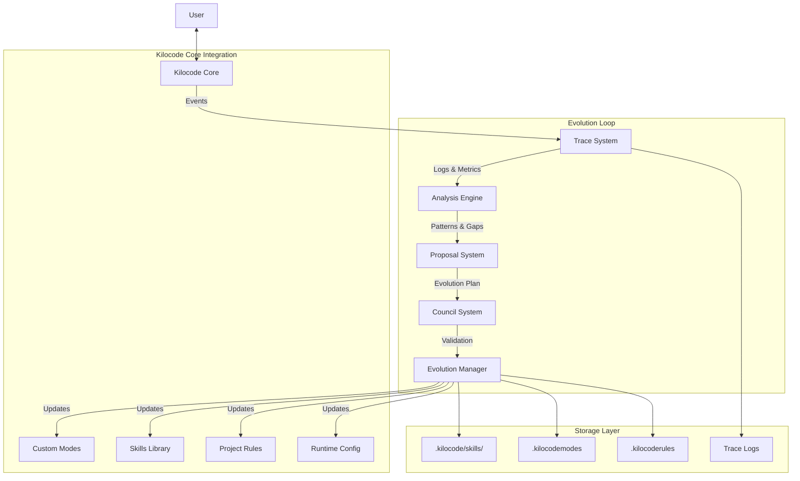

# Darwin Evolution System: Unified Architecture

## Executive Summary

The **Darwin Evolution System** transforms Kilocode from a static development tool into a self-improving AI coding assistant. By integrating Anthropic's "Skills" pattern, deep configuration evolution, and a project-local override strategy, Darwin enables Kilocode to adapt its behavior, tools, and knowledge to the specific needs of every project and user.

**Key Capabilities:**

1.  **Autonomous Skill Synthesis**: Darwin detects capability gaps and writes its own tools (Skills) to fill them, reducing context usage by up to 98%.
2.  **Deep Configuration Evolution**: Every aspect of Kilocode—from mode prompts to temperature settings—is subject to optimization based on success patterns.
3.  **Project-Local Adaptation**: Darwin leverages `.kilocodemodes` and `.kilocoderules` to "patch" the agent's behavior specifically for the current workspace.
4.  **Self-Healing Workflows**: The system detects "doom loops" (repetitive failures) and proactively proposes strategies to break them.

## 1. System Overview

Darwin operates as a continuous feedback loop integrated into the core of Kilocode. It does not require a separate "agent" process but rather leverages specialized **Modes** and **Background Services** to observe, analyze, and evolve.

### High-Level Architecture



### Core Components

1.  **Trace System**: The nervous system. Captures high-fidelity "Evolution Events" (tool errors, user corrections, context overflows) alongside standard telemetry.
2.  **Analysis Engine**: The brain. A background process (or "Analyst Mode") that scans traces for patterns, identifying "doom loops" or capability gaps.
3.  **Proposal System**: The architect. Generates structured `EvolutionProposal` objects (e.g., "Create 'Deploy' Skill", "Lower Architect Mode Temperature").
4.  **Council System**: The conscience. A multi-agent review board (Orchestrator, Reviewer, Security) that validates proposals before application.
5.  **Evolution Manager**: The hand. Applies approved changes to the file system (`.kilocodemodes`, `.kilocode/skills/`) or runtime configuration.
6.  **Skills Library**: The toolbox. A repository of synthesized scripts that extend Kilocode's capabilities without bloating the context window.

### Data Flow

1.  **Observe**: User corrects the agent ("Don't use `any`"). Trace System logs `UserCorrection` event.
2.  **Analyze**: Analysis Engine detects this correction has happened 3 times in this project.
3.  **Propose**: Proposal System suggests adding a rule to `.kilocoderules`.
4.  **Validate**: Council checks if the rule conflicts with existing rules.
5.  **Apply**: Evolution Manager appends the rule.
6.  **Learn**: Future tasks respect the new rule; Trace System confirms reduced corrections.

## 2. Skills Library Architecture

The **Skills Library** is the repository of Darwin's learned capabilities. It replaces the concept of static "Tools" with dynamic "Skills"—synthesized scripts that encapsulate complex logic.

### 2.1 Skill vs. Tool vs. MCP

| Concept        | Definition                                                             | Example                        | Context Cost                     |
| :------------- | :--------------------------------------------------------------------- | :----------------------------- | :------------------------------- |
| **Tool**       | A primitive operation provided by the IDE or an MCP server.            | `read_file`, `execute_command` | High (if all definitions loaded) |
| **Skill**      | A synthesized script composed of multiple tools/logic, stored locally. | `analyze_sql_performance.ts`   | **Near Zero** (loaded on demand) |
| **MCP Server** | A bridge exposing external capabilities.                               | `postgres-mcp`                 | Medium (depends on tool count)   |

**Key Insight**: Darwin uses _Tools_ to write _Skills_. The agent primarily interacts with the _Skills Library_ to execute complex tasks, keeping the system prompt clean.

### 2.2 Architecture

1.  **Storage**: Skills are stored in the project's `.kilocode/skills/` directory.

    - Format: TypeScript (`.ts`) or Python (`.py`) scripts.
    - Structure:
        ```
        .kilocode/skills/
        ├── index.json          # Registry of available skills (name, description, args)
        ├── deploy_staging.ts   # Implementation of 'deploy_staging'
        └── db_migration.py     # Implementation of 'db_migration'
        ```

2.  **Discovery**:

    - Darwin maintains a lightweight `index.json` containing only the function signatures and descriptions.
    - This index is injected into the system prompt (or available via a `list_skills` tool), consuming minimal tokens compared to full tool definitions.

3.  **Execution Model**:
    - **Invocation**: Agent calls `use_skill(name="deploy_staging", args={...})`.
    - **Resolution**: Kilocode looks up `deploy_staging.ts` in `.kilocode/skills/`.
    - **Runtime**: The script is executed in a secure sandbox (or via `execute_command` if trusted).
    - **Output**: The script's `stdout` is returned to the agent.

### 2.3 Skill Synthesis Workflow

1.  **Gap Detection**: Agent realizes it needs to perform a complex, repetitive task (e.g., "Check all 5 microservices health").
2.  **Drafting**: Agent writes a script (`check_health.ts`) using `write_to_file`.
3.  **Registration**: Agent updates `.kilocode/skills/index.json` with the new skill's metadata.
4.  **Validation**: Agent runs the skill with a test case.
5.  **Availability**: The skill is now available for future tasks via `use_skill`.

## 3. Configuration Evolution System

Darwin treats Kilocode's configuration as a dynamic, evolving organism. Every setting is subject to optimization based on learning signals.

### 3.1 Evolution Matrix

| Configuration        | Location         | Evolution Strategy                                                      | Learning Signal                                    | Validation                               |
| :------------------- | :--------------- | :---------------------------------------------------------------------- | :------------------------------------------------- | :--------------------------------------- |
| **Mode Definitions** | `.kilocodemodes` | **Specialization**: Create project-specific modes for unique stacks.    | Task failure rate in generic modes.                | Dry run with test prompt.                |
| **Mode Temperature** | `.kilocodemodes` | **Auto-Tuning**: Adjust temp based on task type (Creative vs. Precise). | High revision rate (hallucinations) -> Lower Temp. | A/B testing on similar tasks.            |
| **Project Rules**    | `.kilocoderules` | **Refinement**: Append rules to prevent recurring errors.               | `UserCorrection` events, Linter errors.            | Check for conflicts with existing rules. |
| **Auto-Approval**    | `settings.json`  | **Trust Building**: Auto-approve low-risk tools after success.          | User consistently approving specific tools.        | Security sandbox check.                  |
| **Context Strategy** | `settings.json`  | **Optimization**: Pre-load frequently co-edited files.                  | "File not found" errors, Context window overflow.  | Recall accuracy (was the file needed?).  |

### 3.2 Evolution Lifecycle

1.  **Signal Capture**: `TraceSystem` records an event (e.g., "User rejected code due to 'no-any' lint error").
2.  **Proposal Generation**: `AnalysisEngine` correlates this to a missing rule and creates a `ConfigEvolutionProposal`.
    ```typescript
    {
      type: "update_rule",
      target: ".kilocoderules",
      content: "Do not use 'any'; use specific types or 'unknown'.",
      reasoning: "User corrected this 3 times in the last hour."
    }
    ```
3.  **Council Review**:
    - **Reviewer**: "Does this rule contradict 'Use TypeScript'?"
    - **Security**: "Is this rule safe?"
4.  **Application**: `EvolutionManager` appends the rule to `.kilocoderules`.
5.  **Rollback**: If the user deletes the rule or explicitly rejects it later, Darwin records this as a "Failed Evolution" and avoids re-proposing it.

## 4. Local Mode Override Strategy

Darwin uses the **Project-Local Mode** mechanism as its primary lever for evolution. Instead of modifying the global extension state (which is risky and affects all projects), Darwin "patches" the agent's behavior for the _current workspace only_.

### 4.1 Precedence Hierarchy

Kilocode resolves Mode definitions in this order:

1.  **Project Modes** (`.kilocodemodes` in workspace root) **[HIGHEST PRIORITY]**
    - _Darwin operates here._
2.  **Global Modes** (`custom_modes.yaml` in user data)
    - _User manual overrides live here._
3.  **Built-in Modes** (Hardcoded defaults) **[LOWEST PRIORITY]**

### 4.2 The "Patching" Workflow

When Darwin wants to evolve the behavior of the "Code" mode for a specific project:

1.  **Read**: Darwin reads the effective definition of the "Code" mode (merging Built-in + Global).
2.  **Modify**: It creates a modified definition (e.g., adding a `rust-expert` role).
3.  **Write**: It saves this new definition to `.kilocodemodes` with the _same slug_ (`code`).
4.  **Effect**: Kilocode immediately loads the local `.kilocodemodes`, and the "Code" mode is now evolved for this project.

### 4.3 Conflict Resolution

- **Slug Collision**: If Darwin creates a mode with an existing slug, it _intentionally_ overrides the parent mode.
- **User Edits**: If the user manually edits `.kilocodemodes`, Darwin respects those changes. It treats the file as the "source of truth" and will only propose _updates_ to it, not overwrite it blindly.
- **Upgrade Path**: If Kilocode ships a new Built-in "Code" mode, the local override remains active. Darwin can be tasked to "Rebase" the local mode on top of the new default (merging changes).

## 5. Feature Integration Map

Darwin is not a silo; it integrates with every major Kilocode feature to create a cohesive intelligent system.

| Feature                | Integration Point     | Darwin Enhancement                                                                                                                                     |
| :--------------------- | :-------------------- | :----------------------------------------------------------------------------------------------------------------------------------------------------- |
| **Context Management** | `ContextManager.ts`   | **Smart Context**: Darwin analyzes file co-occurrence patterns to predict and pre-load relevant files, reducing "File not found" loops.                |
| **Tool System**        | `McpHub.ts`           | **Skill Synthesis**: Darwin extends the toolset by writing scripts to `.kilocode/skills/` and registering them as ad-hoc tools.                        |
| **Task Management**    | `Task.ts`             | **Auto-Delegation**: Darwin analyzes task complexity. If high, it spawns child tasks with specialized modes (e.g., "Plan" -> "Implement" -> "Review"). |
| **History & Learning** | `TaskHistory.ts`      | **Semantic Memory**: Darwin indexes successful task traces. When a similar task appears, it retrieves the "proven path" to guide execution.            |
| **Telemetry**          | `TelemetryService.ts` | **Evolution Signals**: Telemetry is the "sensory input". Darwin monitors error rates, latency, and user feedback to trigger evolution.                 |
| **Approval System**    | `AskFollowup.ts`      | **Trust Scoring**: Darwin builds a trust score for tools. High trust + low risk = Auto-approval (if enabled), reducing user friction.                  |
| **Shell Integration**  | `Terminal.ts`         | **Script Synthesis**: Instead of running 10 fragile shell commands, Darwin synthesizes a robust `.sh` or `.py` script and executes it once.            |
| **Evaluation**         | `Evals`               | **Continuous Self-Eval**: When idle, Darwin can run regression tests on its own skills and configuration to ensure stability.                          |

## 6. Advanced Evolution Scenarios

These scenarios illustrate Darwin's end-to-end workflow in complex situations.

### Scenario A: The "Doom Loop" Breaker

- **Trigger**: `AnalysisEngine` detects a `ToolErrorPattern`: The agent has tried to edit `app.ts` 3 times, failing with the same "File is read-only" error each time.
- **Analysis**: Darwin recognizes this as a "Doom Loop". The root cause is a missing permission or file lock.
- **Proposal**: "Stop editing. Check file permissions. If read-only, propose `chmod` or ask user to unlock."
- **Action**: Darwin interrupts the current task with a `SystemPrompt` injection: "STOP. You are in a loop. Check file permissions."
- **Learning**: Darwin adds a rule to `.kilocoderules`: "Always check file write permissions before editing."

### Scenario B: Skill Synthesis (The "Deploy" Script)

- **Trigger**: User asks "Deploy to staging". The agent executes 5 separate shell commands; 2 fail due to timing issues.
- **Analysis**: `GapDetector` notes high friction and failure rate for "deploy" intent.
- **Proposal**: "Synthesize a `deploy_staging.sh` skill to encapsulate this workflow."
- **Validation**: Darwin writes the script, runs it in `--dry-run` mode (if supported) or asks user to validate.
- **Application**: The script is saved to `.kilocode/skills/deploy_staging.sh`. A new skill `deploy_staging` is registered.
- **Result**: Next time, the agent calls `use_skill('deploy_staging')`. Success rate improves to 100%.

### Scenario C: Mode Auto-Tuning (Temperature A/B Test)

- **Trigger**: "Architect" mode tasks have a high "User Revision Rate" (user asks for changes 3+ times per task).
- **Analysis**: Darwin hypothesizes the temperature (0.7) is too high, causing hallucinations.
- **Proposal**: "Lower 'Architect' mode temperature to 0.4."
- **Validation**: Darwin creates a local override in `.kilocodemodes` with `temperature: 0.4`.
- **Learning**: Over the next week, Darwin monitors the revision rate. If it drops, the change becomes permanent.

## 7. Unified Data Model

The following TypeScript interfaces define the core data structures for the Darwin system.

```typescript
/**
 * Represents a synthesized capability.
 */
export interface Skill {
	name: string
	description: string
	parameters: Record<string, any> // JSON Schema
	implementationPath: string // Relative to .kilocode/skills/
	runtime: "typescript" | "python" | "shell"
	permissions: string[] // e.g., ["read_file", "network"]
}

/**
 * Represents a proposed change to the system configuration.
 */
export interface ConfigEvolutionProposal {
	id: string
	timestamp: number
	type: "update_rule" | "modify_mode" | "create_skill" | "tune_config"
	target: string // e.g., ".kilocoderules", "architect-mode"
	content: any // The actual change payload
	reasoning: string // Why is this being proposed?
	evidence: TraceEvent[] // The signals that triggered this
	status: "pending" | "approved" | "rejected" | "applied"
}

/**
 * Represents a local override for a Mode.
 */
export interface ModeOverride {
	slug: string
	name?: string
	roleDefinition?: string
	customInstructions?: string
	temperature?: number
	groups?: string[] // Tool groups
	skills?: string[] // Linked skills
}

/**
 * Represents a signal captured by the Trace System.
 */
export interface LearningSignal {
	id: string
	type: "user_correction" | "tool_error" | "success_pattern" | "context_overflow"
	severity: number // 0-1
	context: {
		taskId: string
		mode: string
		tool?: string
		userMessage?: string
	}
}

/**
 * The persistent state of the Evolution System.
 */
export interface EvolutionHistory {
	proposals: ConfigEvolutionProposal[]
	skills: Skill[]
	metrics: {
		doomLoopsAvoided: number
		skillsSynthesized: number
		rulesRefined: number
	}
}
```

## 8. Updated Implementation Roadmap

This roadmap integrates the advanced capabilities into a 4-phase execution plan.

### Phase 1: Foundation (Weeks 1-3)

**Goal**: Establish the nervous system (Trace) and brain (Analysis).

- [ ] **Trace System**: Implement `TraceSystem` to log `LearningSignal` events.
- [ ] **Analysis Engine**: Build regex-based "Doom Loop" detector.
- [ ] **Manual Evolution**: Add command to manually append to `.kilocoderules`.
- [ ] **Skills Library**: Create `.kilocode/skills/` directory structure and `use_skill` tool stub.

### Phase 2: Intelligence (Weeks 4-7)

**Goal**: Enable configuration evolution and local overrides.

- [ ] **Mode Evolution**: Implement `.kilocodemodes` reader/writer with precedence logic.
- [ ] **Proposal System**: Build `ProposalManager` to generate and store `ConfigEvolutionProposal`.
- [ ] **Council MVP**: Implement basic "Review" step (user acts as Council).
- [ ] **Context Optimization**: Implement basic file co-occurrence tracking.

### Phase 3: Tool Evolution (Weeks 8-12)

**Goal**: Enable autonomous skill synthesis.

- [ ] **Skill Synthesizer**: Implement logic to write TS/Python scripts to `.kilocode/skills/`.
- [ ] **Skill Executor**: Implement secure sandbox for running skills.
- [ ] **Gap Detector**: Analyze chat for "I can't do that" signals.
- [ ] **Auto-Registration**: Dynamically update `index.json` when new skills are created.

### Phase 4: Autonomy (Weeks 13-16)

**Goal**: Close the loop with minimal human intervention.

- [ ] **Full Council**: Implement `delegateParentAndOpenChild` for automated Reviewer/Security checks.
- [ ] **Auto-Approval**: Implement trust scoring to auto-approve low-risk proposals.
- [ ] **A/B Testing**: Implement framework for testing mode temperature/prompt variations.
- [ ] **Cross-Project Learning**: (Optional) Mechanism to share generic skills across projects.

## 9. Security & Safety

Darwin introduces autonomous behavior, which requires strict safety boundaries.

1.  **Write Boundaries**:

    - Darwin can **ONLY** write to: `.kilocode/`, `.kilocodemodes`, `.kilocoderules`.
    - Darwin **CANNOT** modify source code directly without explicit user task.
    - Darwin **CANNOT** modify global VS Code settings (only workspace settings).

2.  **Validation Layers**:

    - **Syntax Check**: All synthesized skills must pass `tsc` or `pylint`.
    - **Sandbox**: Skills are executed in a restricted environment (no network unless requested).
    - **Council Review**: All proposals must pass the Council (Automated + User Gate).

3.  **Rollback Mechanisms**:
    - **Git Integration**: All evolution changes are committed to a shadow branch or use `ShadowCheckpointService`.
    - **"Reset Evolution"**: A panic button to delete `.kilocode/` and revert to factory defaults.

## 10. Metrics & Observability

To ensure Darwin is actually improving the system, we track:

- **Evolution Velocity**: Number of proposals generated vs. applied per week.
- **Skill Usage**: How often synthesized skills are used vs. native tools.
- **Correction Rate**: Frequency of `UserCorrection` events (should trend down).
- **Task Success Rate**: Percentage of tasks completed without error.
- **Context Efficiency**: Reduction in tokens used per task (due to Skills vs. Tools).

---

_This architecture represents the unified vision for the Darwin Evolution System, transforming Kilocode into a self-improving, adaptive AI partner._
