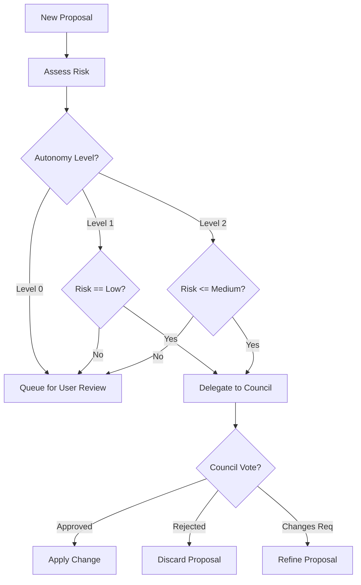
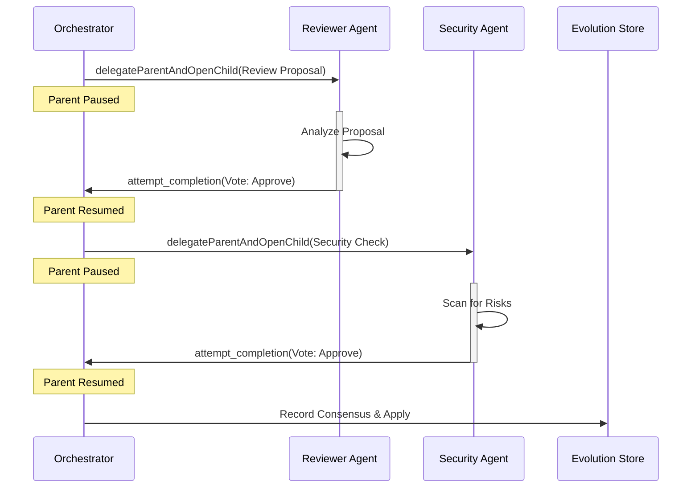
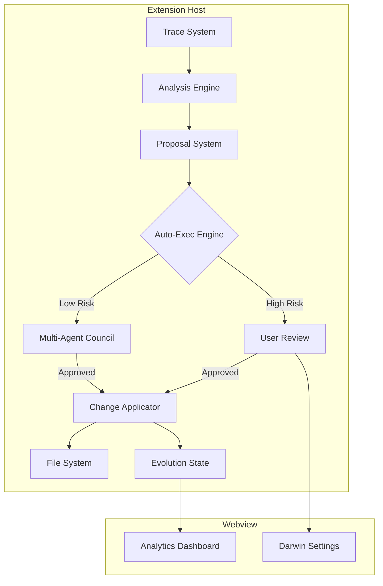

# Darwin Evolution System: Phase 4 Autonomy Architecture

## 1. Executive Summary

Phase 4 "Autonomy" transforms Darwin from a passive advisor into an active, self-regulating system. It introduces the **Autonomous Execution Engine**, a real **Multi-Agent Council**, and **LLM-Powered Skill Synthesis**, enabling Kilocode to evolve its capabilities with minimal human intervention while maintaining strict safety boundaries.

**Key Goals:**

1.  **Close the Loop**: Automate the "Proposal -> Approval -> Application" cycle based on risk and autonomy settings.
2.  **Real Multi-Agent Review**: Replace simulated checks with actual agent delegation for robust validation.
3.  **Generative Skills**: Move from static templates to dynamic, context-aware skill synthesis using LLMs.
4.  **Observability**: Provide a real-time dashboard for tracking evolution metrics.

---

## 2. Autonomous Execution Engine

The Execution Engine is the heartbeat of Phase 4. It evaluates pending proposals against the user's autonomy settings and risk profile to decide whether to auto-apply, request review, or reject.

### 2.1 Risk Assessment Logic

Every `EvolutionProposal` is assigned a risk level (`low`, `medium`, `high`) based on its content.

| Risk Level | Criteria                                                                                                                                                         | Autonomy Level Required for Auto-Apply |
| :--------- | :--------------------------------------------------------------------------------------------------------------------------------------------------------------- | :------------------------------------- |
| **Low**    | • Creating new files (no overwrite)<br>• Adding new skills<br>• Appending to `.kilocoderules`<br>• Read-only config changes                                      | **Level 1 (Assisted)**                 |
| **Medium** | • Modifying existing non-critical files<br>• Updating mode prompts<br>• Changing temperature/model settings                                                      | **Level 2 (Auto)**                     |
| **High**   | • Deleting files<br>• Modifying critical files (`package.json`, `.env`, `.gitignore`)<br>• Network operations (unknown domains)<br>• Overwriting existing skills | **Never (Always Manual)**              |

### 2.2 Execution Loop

The `EvolutionService` runs a background loop (or event-driven trigger) to process proposals.



### 2.3 Integration with EvolutionEngine

The `EvolutionEngine` (Phase 3) is extended to support this loop:

```typescript
// src/shared/evolution/EvolutionEngine.ts

export class EvolutionEngine {
	// ... existing code ...

	private async processProposal(proposal: EvolutionProposal): Promise<void> {
		const config = await this.configService.getConfig()
		const risk = this.assessRisk(proposal)

		if (config.canAutoApply(risk)) {
			// Autonomous Path
			const councilResult = await this.council.review(proposal)
			if (councilResult.approved) {
				await this.applicator.apply(proposal)
			}
		} else {
			// Manual Path
			await this.notifyUser(proposal)
		}
	}
}
```

---

## 3. Real Multi-Agent Council

Phase 4 replaces the simulated council with real, specialized agent instances using the `delegateParentAndOpenChild` mechanism. This ensures that proposals are vetted by independent "eyes" with distinct system prompts.

### 3.1 Sequential Delegation Architecture

Due to the single-active-task invariant of `ClineProvider`, the Council operates as a **Sequential Chain of Responsibility**.

1.  **Orchestrator (Parent)**: The main task or background process generating the proposal.
2.  **Reviewer (Child 1)**: Validates quality, consistency, and necessity.
3.  **Security (Child 2)**: Validates safety, permissions, and potential exploits.

### 3.2 Workflow



### 3.3 Implementation Strategy

We utilize `ClineProvider.delegateParentAndOpenChild` to spawn these agents.

```typescript
// src/shared/evolution/council/MultiAgentCouncil.ts

export class MultiAgentCouncil implements ICouncil {
	constructor(private provider: ClineProvider) {}

	async review(proposal: EvolutionProposal): Promise<CouncilResult> {
		// 1. Delegate to Reviewer
		const reviewerTask = await this.provider.delegateParentAndOpenChild({
			parentTaskId: this.provider.getCurrentTask().taskId,
			message: `Review this evolution proposal: ${JSON.stringify(proposal)}`,
			initialTodos: [],
			mode: "code-reviewer", // Specialized mode
		})

		// ... Wait for completion (handled via event listeners or polling) ...

		// 2. Delegate to Security (if Reviewer approved)
		// ...
	}
}
```

---

## 4. LLM-Powered Skill Synthesis

We replace the regex-based `SkillSynthesizer` with `LLMSkillSynthesizer`, capable of writing complex, context-aware TypeScript skills.

### 4.1 Synthesis Pipeline

1.  **Context Gathering**: Collect related files, error logs, and existing skills.
2.  **Prompt Engineering**: Construct a prompt that enforces:
    - Strict TypeScript typing.
    - Error handling (try/catch).
    - No global side effects.
    - Adherence to `Skill` interface.
3.  **Generation**: Call the LLM (via `ApiHandler`).
4.  **Validation**:
    - **Syntax Check**: `tsc --noEmit`.
    - **Safety Scan**: Regex check for dangerous imports (`child_process`, `fs` without guards).
    - **Functional Test**: Generate and run a Vitest test case.

### 4.2 Prompt Structure

```text
You are an expert TypeScript developer. Write a Kilocode Skill to solve this problem:
"{{problem_description}}"

Requirements:
1. Implement the 'main' function exporting the 'Skill' interface.
2. Use Zod for argument validation.
3. Handle all errors gracefully.
4. Return a structured Result object.

Context:
{{related_code_snippets}}

Output ONLY the TypeScript code.
```

### 4.3 Integration

The `LLMSkillSynthesizer` implements the same interface as the template-based one, allowing seamless swapping.

```typescript
// src/shared/evolution/skills/LLMSkillSynthesizer.ts

export class LLMSkillSynthesizer implements ISkillSynthesizer {
	async synthesize(request: SkillSynthesisRequest): Promise<SynthesisResult> {
		// 1. Construct Prompt
		// 2. Call LLM
		// 3. Extract Code
		// 4. Validate & Test
		// 5. Return Result
	}
}
```

---

## 5. Analytics Dashboard

A new tab in the Settings UI provides visibility into Darwin's operations.

### 5.1 UI Architecture

Located in `webview-ui/src/components/darwin/`.

- **`DarwinDashboard.tsx`**: Main entry point.
- **`MetricsOverview.tsx`**: Cards for "Skills Created", "Doom Loops Fixed", "Autonomy Score".
- **`SkillUsageGraph.tsx`**: Visualization of which skills are used most.
- **`EvolutionTimeline.tsx`**: A feed of recent proposals and their status.

### 5.2 Data Flow

1.  **Extension**: `EvolutionService` aggregates stats from `EvolutionStore`.
2.  **Message**: `postMessageToWebview({ type: "evolutionState", state: ... })`.
3.  **Webview**: React Context updates, triggering re-render of dashboard.

### 5.3 Key Metrics

- **Evolution Velocity**: Proposals applied per day.
- **Intervention Rate**: % of proposals requiring manual fix.
- **Skill ROI**: (Times Used) \* (Time Saved per Use).

---

## 6. Integration Points & Data Flow

### 6.1 System Diagram



### 6.2 API Contracts

**EvolutionService API**:

- `getEvolutionState(): Promise<EvolutionState>`
- `approveProposal(id: string): Promise<void>`
- `rejectProposal(id: string): Promise<void>`
- `triggerAnalysis(taskId: string): Promise<AnalysisReport>`

**Skill API**:

- `executeSkill(id: string, args: any): Promise<SkillResult>`
- `validateSkill(code: string): Promise<ValidationResult>`

### 6.3 Event System Extensions

New events in `RooCodeEventName`:

- `EvolutionProposalCreated`
- `EvolutionProposalApplied`
- `SkillSynthesized`
- `CouncilVoteCast`

---

## 7. Migration & Compatibility

- **Backward Compatibility**: Phase 4 builds on Phase 3 types. Existing skills and history are preserved.
- **Fallback**: If LLM synthesis fails, fall back to Template synthesis.
- **Safety**: Autonomy defaults to Level 0 (Manual) on upgrade. User must explicitly enable Level 1 or 2.

## 8. Testing Strategy

1.  **Unit Tests**:
    - Risk assessment logic.
    - Prompt construction.
    - Dashboard component rendering.
2.  **Integration Tests**:
    - End-to-end "Doom Loop" -> "Skill Synthesis" -> "Execution" flow.
    - Council delegation flow (mocking the child task response).
3.  **Safety Tests**:
    - Verify High-Risk proposals are NEVER auto-applied.
    - Verify synthesized skills cannot access restricted APIs.
