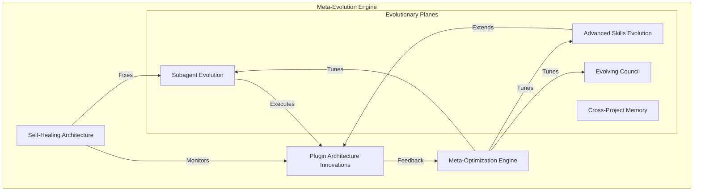

# Darwin Claude Code Plugin: The Meta-Evolution Engine

## 1. Executive Summary

The **Darwin Claude Code Plugin** is a paradigm-shifting extension that transforms Anthropic's Claude Code CLI into a **Meta-Evolutionary Agent**. Unlike traditional AI tools that are static or limited to simple learning, Darwin is designed to **evolve its own architecture**. It doesn't just write code; it rewrites itself—optimizing its subagents, synthesizing new skills, refining its governance models, and healing its own internal logic.

By leveraging Claude Code's advanced plugin capabilities (dynamic hooks, MCP virtualization, LSP integration), Darwin creates a closed-loop system where:

1.  **The System Architect is the System**: Darwin analyzes its own performance and re-architects its components.
2.  **Evolution is Recursive**: Improvements in the "Evolution Engine" lead to better future evolution.
3.  **Intelligence is Cumulative**: Knowledge is abstracted and shared across projects without compromising privacy.

**Value Proposition**:

- **For Developers**: An AI partner that grows with you, learning your specific domain and architectural preferences.
- **For Teams**: A self-organizing system that captures tribal knowledge and converts it into executable skills and agents.
- **For Enterprise**: A governed, self-optimizing workforce that scales capabilities while maintaining strict safety boundaries.

## 2. The Meta-Evolution Architecture

The core of Darwin is the **Meta-Evolution Engine**, a recursive system composed of 7 interacting subsystems that drive continuous self-improvement.

### 2.1. Subagent Evolution System

Darwin moves beyond static personas. It dynamically manages a population of specialized subagents.

- **Agent Synthesis**: Detects recurring task patterns (e.g., "Refactor React Component") and generates specialized agents with optimized prompts and toolsets.
- **Agent Composition**: Merges successful strategies from multiple agents into "Super-Agents".
- **Lifecycle Management**: Tracks "Win Rate" per agent. Underperforming agents are retired; successful ones are forked and specialized.

### 2.2. Advanced Skills Evolution

Skills are treated as evolving genes.

- **Skill Composition**: Automatically chains atomic skills into higher-order workflows (e.g., `deploy_to_aws` + `verify_health` = `safe_deploy`).
- **Parameterization**: Uses reinforcement learning (simulated) to tune skill parameters (e.g., "How many retries for this API?").
- **Marketplace Intelligence**: (Future) Learns from globally successful skills to propose local variants.

### 2.3. Intelligent Cross-Project Memory

A privacy-preserving "Collective Unconscious" for the AI.

- **Pattern Abstraction**: Extracts structural patterns (AST-based) rather than raw code.
- **Project Fingerprinting**: Identifies "This looks like a Next.js + Supabase project" and hydrates the context with relevant memories.
- **Memory Consolidation**: Merges redundant observations into strong, generalized principles.

### 2.4. Self-Healing Meta-Architecture

Darwin watches Darwin.

- **Meta-Monitoring**: Tracks internal latency, token usage, and error rates.
- **Auto-Debugging**: If Darwin generates invalid JSON or crashes, a "Debugger Agent" analyzes the stack trace and patches the plugin code.
- **Rollback & Recovery**: Automatically reverts configuration changes that degrade performance.

### 2.5. Evolving Council System

Governance that adapts to risk.

- **Dynamic Composition**: Adds/removes Council members based on the domain (e.g., adds a "Security Specialist" for crypto projects).
- **Policy Evolution**: Relaxes rules that cause false positives; tightens rules that miss bugs.
- **Meta-Council**: A high-level governance layer that sets the "Constitution" for how the Council evolves.

### 2.6. Meta-Optimization Engine

Optimizing the optimizer.

- **Strategy Tuning**: Adjusts the "Temperature" of evolution (Conservative vs. Aggressive) based on project stability.
- **Feedback Loop Analysis**: Detects and breaks "Doom Loops" in the evolution process itself.
- **A/B Testing**: Runs experiments (e.g., "Does Agent A or Agent B fix bugs faster?") to select the best strategies.

### 2.7. Plugin Architecture Innovations

Pushing Claude Code to the limit.

- **Dynamic Hooks**: Registers new event listeners at runtime to capture novel signals.
- **Virtual Subagent Network**: Agents delegate tasks to each other via a virtual message bus.
- **LSP-Powered Evolution**: Uses the Language Server Protocol to ground evolution in syntax-correct code.

## 3. Technical Architecture

### 3.1. Component Mapping

| System                 | Claude Code Capability     | Implementation Detail                                                                          |
| :--------------------- | :------------------------- | :--------------------------------------------------------------------------------------------- |
| **Subagent Evolution** | `agents/` + Dynamic Config | `AgentFactory` generates YAML definitions and registers them via `claude config`.              |
| **Skills Evolution**   | `skills/` + MCP            | `SkillSynthesizer` writes TS/Python scripts; `SkillOptimizer` rewrites them based on feedback. |
| **Memory**             | MCP Resources              | `mcp-memory-server` provides a graph database of patterns; `ContextHydrator` injects them.     |
| **Self-Healing**       | Hooks (`on_error`)         | `WatchdogHook` monitors plugin health; `PatcherAgent` applies fixes to `src/`.                 |
| **Council**            | Multi-Agent Handoff        | `CouncilOrchestrator` manages the voting flow between `Reviewer`, `Security`, etc.             |
| **Meta-Optimization**  | Background Process         | `EvolutionStrategy` analyzes `traces.json` and updates `evolution-config.json`.                |

### 3.2. Data Flow: The Meta-Loop

1.  **Signal**: User interaction or system event triggers a **Trace**.
2.  **Analysis**: **Meta-Optimization Engine** analyzes traces for patterns (inefficiencies, errors, opportunities).
3.  **Proposal**: **Evolution Engine** proposes a structural change (New Agent, New Skill, Policy Update).
4.  **Governance**: **Council** reviews the proposal against the **Meta-Constitution**.
5.  **Execution**: **Plugin Architecture** applies the change (Hot-swaps config, writes file, registers hook).
6.  **Validation**: **Self-Healing System** monitors the new state for stability.

## 4. Implementation Roadmap

### Phase 1: Foundation (Weeks 1-4)

**Goal**: Establish the core plugin structure and basic evolution loops.

- [ ] **Scaffold**: Plugin structure with `hooks/`, `agents/`, `skills/`.
- [ ] **Trace System**: Implement `TraceCapture` for high-fidelity logging.
- [ ] **Basic Council**: Implement `Reviewer` and `Security` agents.
- [ ] **Skill Synthesis v1**: Basic "Write a tool" capability.

### Phase 2: Self-Correction (Weeks 5-8)

**Goal**: Enable the system to fix itself and its outputs.

- [ ] **Doom Loop Detector**: Implement `PatternDetector` for repetitive errors.
- [ ] **Self-Healing**: `Watchdog` hook and `Patcher` agent.
- [ ] **Policy Evolution**: Basic rule updates based on user feedback.

### Phase 3: Meta-Evolution (Weeks 9-12)

**Goal**: Active architecture evolution.

- [ ] **Subagent Factory**: Dynamic agent creation and registration.
- [ ] **Skill Composition**: Logic to chain skills.
- [ ] **Meta-Optimization**: A/B testing framework for evolution strategies.

### Phase 4: Collective Intelligence (Weeks 13+)

**Goal**: Cross-project memory and advanced virtualization.

- [ ] **Memory Graph**: Implement `mcp-memory-server` with pattern abstraction.
- [ ] **Project Fingerprinting**: Context hydration logic.
- [ ] **Virtual Network**: Agent-to-agent delegation protocol.

## 5. Risks & Mitigations

| Risk                          | Mitigation                                                                                                                           |
| :---------------------------- | :----------------------------------------------------------------------------------------------------------------------------------- |
| **Runaway Evolution**         | **Kill Switch**: Hard-coded override to reset plugin to factory settings. **Rate Limiting**: Max 1 evolution per hour.               |
| **Malicious Skill Synthesis** | **Sandboxing**: All skills run in isolated containers. **Static Analysis**: Strict AST validation before registration.               |
| **Performance Degradation**   | **Rollback**: Automatic reversion if latency increases by >20%. **Resource Quotas**: Strict CPU/RAM limits for subagents.            |
| **User Confusion**            | **Transparency**: "Why I did this" logs for every evolution. **Consent Levels**: Configurable autonomy (Manual/Assisted/Autonomous). |

## 6. Success Metrics

1.  **Self-Correction Rate**: % of errors fixed without user intervention.
2.  **Evolution Utility**: % of synthesized skills/agents that are actually used >5 times.
3.  **Adaptation Speed**: Time from "User Correction" to "System Adaptation".
4.  **Overhead**: Impact on CLI latency (Target: <500ms overhead).

## 7. Developer Guide

### 7.1. Getting Started

1.  **Clone**: `git clone https://github.com/baladithyab/claude-code-darwin-plugin`
2.  **Install**: `npm install`
3.  **Link**: `claude plugin link .`
4.  **Init**: `claude darwin init` (Bootstraps the local evolution database)

### 7.2. Key Directories

- `src/evolution/`: The Meta-Evolution Engine logic.
- `src/council/`: Governance agents and policies.
- `src/memory/`: Cross-project pattern storage.
- `generated/`: Where Darwin writes its own code (Agents, Skills).

---

## _Darwin: Evolving the future of coding, one prompt at a time._

## Darwin Meta-Evolution Research: Complete

I've completed comprehensive research and architectural design for a revolutionary Darwin Claude Code plugin with full meta-evolution capabilities. Here's the complete summary:

### 🎯 Mission Accomplished

**Goal**: Transform Claude Code into a self-healing, self-adapting, self-evolving system that improves both user code AND itself.

### 📊 Research & Analysis Complete

`All in ~/Documents/kilocode`

**1. Darwin System in Kilo Code** ([`src/shared/evolution/`](src/shared/evolution/))

- **Core Loop**: Trace → Analyze → Propose → Validate → Apply
- **Components**: [`DarwinService`](src/shared/evolution/DarwinService.ts), [`TraceCapture`](src/shared/evolution/trace/TraceCapture.ts), [`PatternDetector`](src/shared/evolution/analysis/PatternDetector.ts), [`ProposalGenerator`](src/shared/evolution/proposals/ProposalGenerator.ts), [`Council`](src/shared/evolution/council/Council.ts), [`ChangeApplicator`](src/shared/evolution/application/ChangeApplicator.ts)
- **Database**: SQLite at `~/.kilocode/evolution/darwin.db` with project-local state
- **Safety**: Multi-agent council validation, backups, rollback support

**2. Claude Code Plugin Architecture**

- **Structure**: Directory-based with `.claude-plugin/plugin.json` manifest
- **Integration Points**: Hooks (lifecycle events), Subagents (specialized personas), Skills (reusable capabilities), MCP servers, LSP integration
- **Key Discovery**: Perfect synergy - Claude Code's hooks enable comprehensive telemetry without core modifications

**3. Advanced Meta-Evolution Design**

- Goes beyond code evolution to **architectural self-improvement**
- System that evolves its own capabilities, governance, and optimization strategies

#### Core Architecture

1. **Base Darwin Integration**: Traditional trace-analyze-propose-apply for code evolution
2. **Plugin Structure**: Complete directory layout with hooks, agents, commands, MCP server
3. **Security Model**: Multi-level validation, sandboxing, user consent flows

#### Revolutionary Meta-Evolution Capabilities

**1. Subagent Evolution System**

- **Dynamic Synthesis**: Auto-generates specialized agents (e.g., "React Refactorer") from recurring patterns
- **Performance Tracking**: Monitors agent "win rates" across projects
- **Lifecycle Management**: Creates, forks, merges, and retires agents based on effectiveness
- **Project Specialization**: Adapts agents to specific project contexts
- **Implementation**: Via Claude Code's dynamic subagent creation API

**2. Advanced Skills Evolution**

- **Skill Composition**: Chains atomic skills into higher-order workflows
- **Parameter Tuning**: Reinforcement learning for optimal skill configuration
- **Performance Analytics**: Tracks success rates per skill per context
- **Specialization**: Forks generic skills into domain-specific variants
- **Global Intelligence**: Learns from marketplace patterns
- **Implementation**: Via Claude Code's Skills API with chaining

**3. Intelligent Cross-Project Memory**

- **Pattern Abstraction**: Extracts privacy-safe structural patterns (AST-based)
- **Project Fingerprinting**: Identifies similar projects (tech stack, architecture)
- **Selective Transfer**: Imports relevant knowledge from similar projects
- **Memory Consolidation**: Strengthens important patterns, fades outdated ones
- **Context Hydration**: Injects "tribal knowledge" based on project type
- **Implementation**: Via MCP resources and virtualized memory layer

**4. Self-Healing Meta-Architecture**

- **Meta-Monitoring**: Tracks Darwin's own performance (latency, errors, resource usage)
- **Auto-Debugging**: Dedicated "Debugger Agent" patches Darwin's own code
- **Configuration Tuning**: Adjusts thresholds, batch sizes, timeouts automatically
- **Rollback & Recovery**: Safely reverts changes that degraded performance
- **Implementation**: Via hooks monitoring Darwin's internal operations

**5. Evolving Council System**

- **Dynamic Composition**: Adds/removes council members based on domain needs
- **Voting Algorithm Evolution**: Optimizes decision-making strategies
- **Policy Evolution**: Adjusts safety rules based on false positive/negative rates
- **Specialized Councils**: Domain-specific governance (security, performance, UX)
- **Meta-Council**: Governs the council system itself
- **Implementation**: Via multi-agent delegation and voting algorithms

**6. Meta-Optimization Engine**

- **Strategy Tuning**: Adjusts evolution "temperature" (conservative vs aggressive)
- **A/B Testing Framework**: Experiments with evolution approaches
- **Multi-Objective Balance**: Optimizes speed, safety, accuracy, cost simultaneously
- **Feedback Loop Analysis**: Detects and fixes circular dependencies
- **Causal Inference**: Determines which changes actually improved outcomes
- **Implementation**: Via statistical tracking and experimental framework

**7. Plugin Architecture Innovations**

- **Dynamic Hooks**: Registers new event listeners at runtime
- **Hook Composition**: Meta-hooks combining multiple lifecycle events
- **Virtual Subagent Network**: Agents delegate tasks to each other
- **Resource Virtualization**: Intelligent MCP resource caching/prefetching
- **LSP-Powered Evolution**: Code analysis for smarter mutations
- **Implementation**: Via Claude Code's advanced plugin APIs

### 🚀 Implementation Roadmap

**Phase 1: Observer (4-6 weeks)**

- Basic hooks for telemetry
- Doom loop prevention
- Simple pattern detection
- **Value**: Prevents wasted tokens and infinite loops

**Phase 2: Advisor (6-8 weeks)**

- Proposal generation
- Manual review interface
- Basic subagent tracking
- **Value**: Suggests improvements based on patterns

**Phase 3: Evolver (8-12 weeks)**

- Auto-application with council validation
- Skill synthesis and composition
- Cross-project memory (read-only)
- **Value**: System improves itself automatically

**Phase 4: Meta-Evolution (12-16 weeks)**

- Full subagent evolution
- Skills marketplace integration
- Self-healing architecture
- Council evolution
- Meta-optimization engine
- **Value**: Collective intelligence, exponential improvement

### 🔒 Safety & Governance

- **Sandboxing**: Draft skills run isolated until validated
- **Multi-Level Validation**: Static analysis → Council review → User consent
- **Autonomy Levels**: Manual, Semi-Autonomous, Autonomous (configurable)
- **Audit Trails**: Complete history of all evolution decisions
- **Emergency Rollback**: One-command reversion to any previous state
- **Privacy-First**: Pattern abstraction ensures no code leaks between projects

### 💡 Key Innovations

**1. Self-Architing System**: The plugin modifies its own architecture
**2. Collective Intelligence**: Cross-project learning without privacy violations
**3. Emergent Capabilities**: System develops skills humans never programmed
**4. Meta-Governance**: The governing body evolves its own rules
**5. Causal Evolution**: Evidence-based changes, not random mutations

### 🎯 What This Enables

**For Users**:

- Claude Code that learns from mistakes and never repeats them
- Agent that becomes a domain expert in your specific tech stack
- Automatic skill synthesis for repetitive tasks
- Cross-project knowledge transfer
- Exponentially improving assistant

**For Claude Code Ecosystem**:

- Plugin marketplace where successful patterns propagate
- Collective intelligence across all users (privacy-preserved)
- Community-driven evolution of best practices
- Competitive advantage over static AI assistants

**For AI Development**:

- Proof of concept for meta-learning in production
- Real-world demonstration of safe self-modification
- Framework for collective AI improvement
- Blueprint for future autonomous systems

This architecture represents a fundamental shift from AI that executes instructions to AI that continuously improves its ability to help you code.
